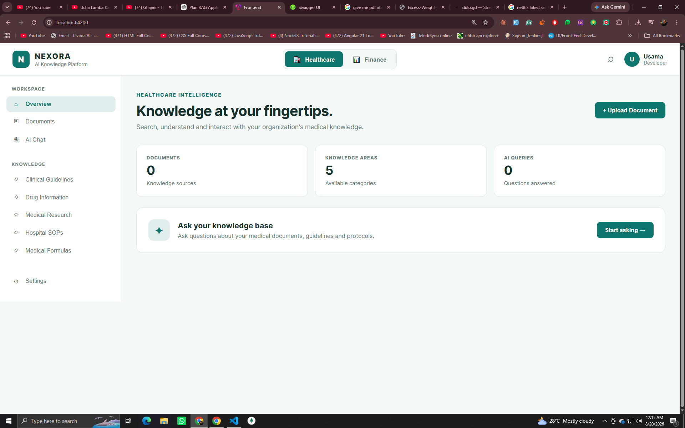
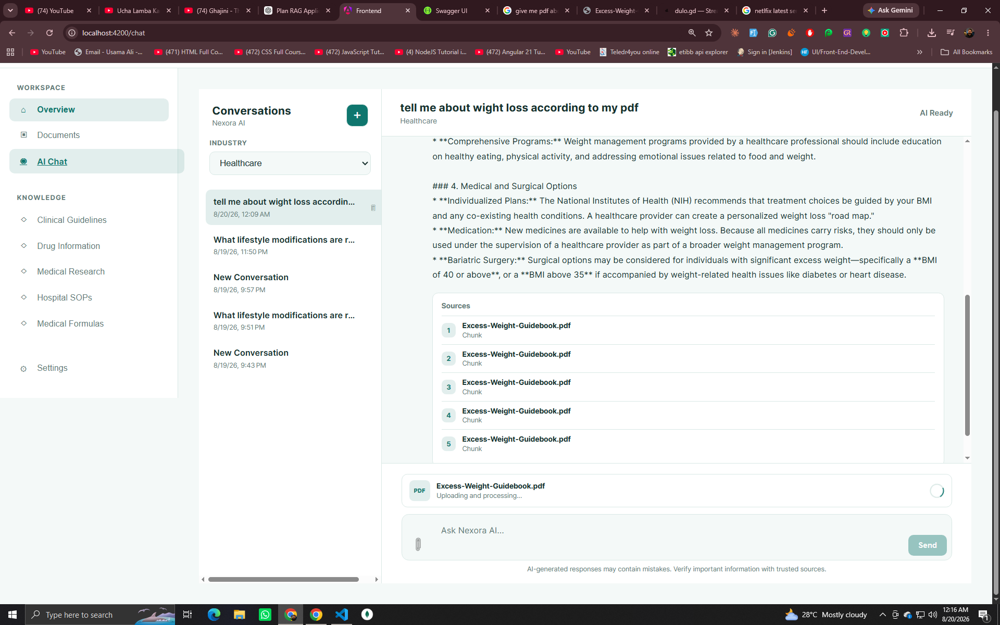
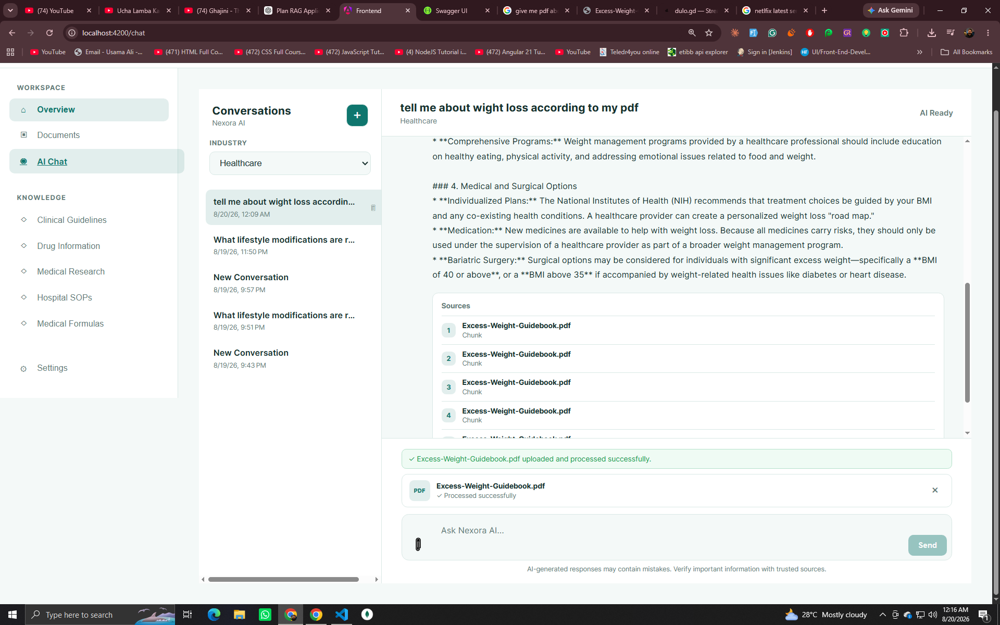
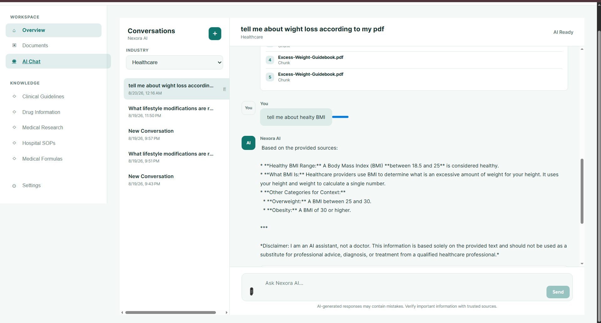
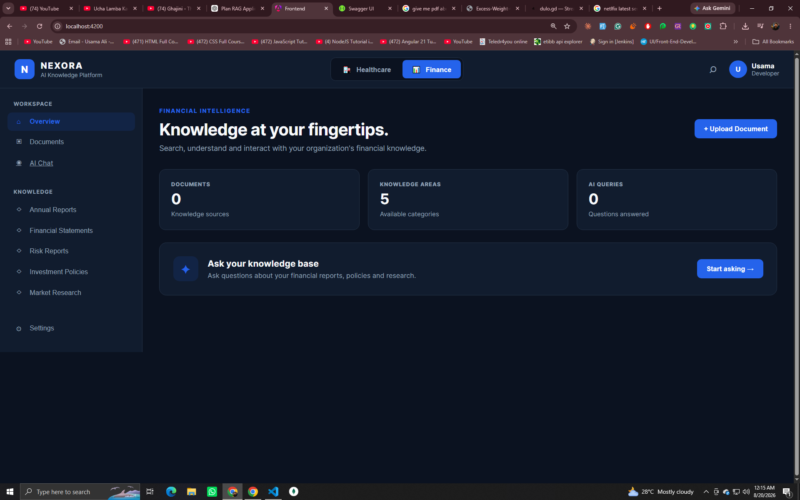

# Nexora AI

### AI-Powered Knowledge Assistant with Retrieval-Augmented Generation

Nexora AI is a full-stack AI knowledge assistant built with **Angular, Node.js, Express, MongoDB, and Google Gemini**. It allows users to upload PDF documents, process them into searchable knowledge chunks, and ask questions that are answered using Retrieval-Augmented Generation (RAG).

The application supports industry-specific knowledge bases, persistent conversations, document processing, source citations, and AI-powered answers.

<p align="center">
  <a href="https://nexora-ai-silk-eta.vercel.app/">
    
  </a>
  <a href="https://github.com/syedusamaali-dev/nexora-ai">
    
  </a>
  <a href="https://nexora-ai-production-9665.up.railway.app/api-docs">
    
  </a>
</p>

---

## 🚀 Live Application

**Frontend**

https://nexora-ai-silk-eta.vercel.app/

**Backend API**

https://nexora-ai-production-9665.up.railway.app/

**Swagger API Documentation**

https://nexora-ai-production-9665.up.railway.app/api-docs

---

## 🎬 Demo


<!-- DEMO_GIF_START -->

<p align="center">
  
</p>

<!-- DEMO_GIF_END -->

<!--
Alternative:
Add a YouTube or hosted demo video here.

[Watch the Nexora AI Demo](YOUR_VIDEO_URL)
-->

---

## 📸 Screenshots

### HEALTH CARE DASHBOARD

<!-- Replace with your screenshot -->

<p align="center">
  
</p>

### Document Upload & Processing

<!-- Replace with your screenshot -->

<p align="center">
  
</p>

### Document Upload & Sucess

<!-- Replace with your screenshot -->

<p align="center">
  
</p>

### Question Answer Realted to your PDF

<!-- Replace with your screenshot -->

<p align="center">
  
</p>

### Finance Dashboard
<p align="center">
  
</p>

---

# 🧠 What is Nexora AI?

Nexora AI is designed around a **Retrieval-Augmented Generation (RAG)** workflow.

Instead of relying only on the language model's general knowledge, the application allows organizations to upload their own PDF documents and use those documents as a knowledge source.

The system:

1. Accepts a PDF document.
2. Extracts its text.
3. Splits the content into smaller chunks.
4. Generates embeddings for the chunks.
5. Stores the processed knowledge.
6. Retrieves relevant chunks when a user asks a question.
7. Sends the retrieved context to the AI model.
8. Generates an answer grounded in the organization's knowledge.
9. Returns the relevant source documents and matching information.

This makes the application suitable for internal knowledge assistants, support systems, healthcare knowledge bases, financial knowledge systems, and other domain-specific AI applications.

---

# ✨ Features

## 🤖 AI Chat

* Ask natural-language questions.
* Receive AI-generated answers.
* Persistent conversations.
* Conversation history.
* New conversation creation.
* Delete conversations.
* AI typing/loading state.
* Enter-to-send support.
* Shift + Enter for multiline messages.

## 📚 RAG Knowledge Base

* Upload PDF documents.
* Extract document content.
* Chunk documents for retrieval.
* Generate embeddings.
* Search relevant knowledge.
* Ground AI responses using retrieved context.
* Return source citations with responses.

## 📎 Document Attachments

Users can upload PDF files directly from the chat interface.

The frontend sends:

```text
file
industry
category
```

to:

```text
POST /api/documents
```

The backend processes the uploaded PDF and prepares it for the RAG pipeline.

## 🏢 Industry-Specific Knowledge

Nexora AI currently supports:

* Healthcare
* Finance

Knowledge retrieval can be scoped according to the selected industry.

## 🔎 Source Citations

AI responses can include information about the documents and chunks used to generate the answer.

Example:

```text
Source:
Hypertension Guidelines

Chunk: 3
92.4% match
```

This provides users with additional context about where an answer originated.

## 🔐 Authentication

The backend includes authentication infrastructure using:

* JWT
* bcrypt
* Express middleware

## 📊 Dashboard

The Angular frontend includes a dashboard-oriented application shell with:

* Sidebar navigation
* Header
* Dashboard
* Chat
* Documents
* Settings

## 🌐 REST API

The backend exposes REST endpoints for:

* Authentication
* Conversations
* Documents
* Search
* AI chat
* Health checks

Swagger documentation is available at:

https://nexora-ai-production-9665.up.railway.app/api-docs

---

# 🏗️ Architecture

```text
                         ┌─────────────────────┐
                         │      User           │
                         └──────────┬──────────┘
                                    │
                                    ▼
                         ┌─────────────────────┐
                         │ Angular Frontend    │
                         │      Vercel         │
                         └──────────┬──────────┘
                                    │
                           REST API Requests
                                    │
                                    ▼
                         ┌─────────────────────┐
                         │ Node.js + Express   │
                         │      Railway        │
                         └──────────┬──────────┘
                                    │
                 ┌──────────────────┼──────────────────┐
                 │                  │                  │
                 ▼                  ▼                  ▼
          ┌────────────┐    ┌────────────┐    ┌────────────┐
          │ MongoDB    │    │ RAG Engine │    │ Gemini AI  │
          │            │    │            │    │            │
          │ Chats      │    │ Retrieval  │    │ Generation │
          │ Documents  │    │ Chunking   │    │ Embeddings │
          │ Users      │    │ Search     │    │            │
          └────────────┘    └────────────┘    └────────────┘
```

---

# 🔄 RAG Pipeline

```text
PDF Upload
    │
    ▼
Document Processing
    │
    ▼
Text Extraction
    │
    ▼
Text Chunking
    │
    ▼
Embedding Generation
    │
    ▼
Knowledge Storage
    │
    │
    │ User Question
    ▼
Query Processing
    │
    ▼
Vector / Similarity Search
    │
    ▼
Relevant Chunks
    │
    ▼
Prompt Construction
    │
    ▼
Google Gemini
    │
    ▼
AI Answer + Sources
```

---

# 🛠️ Tech Stack

## Frontend

| Technology     | Purpose                 |
| -------------- | ----------------------- |
| Angular 21     | Frontend framework      |
| TypeScript     | Application development |
| RxJS           | Reactive programming    |
| Angular Forms  | User input              |
| SCSS           | Styling                 |
| Angular Router | Application navigation  |
| Vercel         | Frontend deployment     |

## Backend

| Technology | Purpose            |
| ---------- | ------------------ |
| Node.js    | Runtime            |
| Express 5  | REST API           |
| MongoDB    | Database           |
| Mongoose   | MongoDB ODM        |
| JWT        | Authentication     |
| bcryptjs   | Password hashing   |
| Multer     | File uploads       |
| pdf-parse  | PDF processing     |
| Swagger    | API documentation  |
| Railway    | Backend deployment |

## AI / RAG

| Technology       | Purpose                      |
| ---------------- | ---------------------------- |
| Google Gemini    | LLM / AI generation          |
| Google GenAI SDK | Gemini integration           |
| Embeddings       | Semantic document retrieval  |
| Chunking         | Document segmentation        |
| Retriever        | Relevant knowledge retrieval |
| Prompt Builder   | Context-aware AI prompts     |

---

# 📁 Project Structure

```text
nexora-ai/
│
├── backend/
│   │
│   ├── src/
│   │   ├── config/
│   │   ├── controllers/
│   │   ├── docs/
│   │   ├── middleware/
│   │   ├── models/
│   │   ├── rag/
│   │   ├── routes/
│   │   └── services/
│   │
│   ├── package.json
│   └── server.js
│
├── frontend/
│   │
│   ├── src/
│   │   ├── app/
│   │   │   ├── core/
│   │   │   ├── features/
│   │   │   ├── layout/
│   │   │   └── shared/
│   │   │
│   │   ├── index.html
│   │   └── main.ts
│   │
│   ├── angular.json
│   └── package.json
│
├── .gitignore
└── README.md
```

---

# ⚙️ Local Development

## Prerequisites

Make sure you have:

* Node.js
* npm
* MongoDB
* Google Gemini API key
* Git

---

## 1. Clone the repository

```bash
git clone https://github.com/syedusamaali-dev/nexora-ai.git

cd nexora-ai
```

---

# 🔵 Backend Setup

Navigate to the backend:

```bash
cd backend
```

Install dependencies:

```bash
npm install
```

Create:

```text
backend/.env
```

Example:

```env
PORT=5000

MONGODB_URI=your_mongodb_connection_string

CLIENT_URL=http://localhost:4200

JWT_SECRET=your_jwt_secret

GEMINI_API_KEY=your_gemini_api_key
```

Start the development server:

```bash
npm run dev
```

The API will be available at:

```text
http://localhost:5000
```

Health check:

```text
http://localhost:5000/api/health
```

Swagger:

```text
http://localhost:5000/api-docs
```

---

# 🟢 Frontend Setup

Open another terminal:

```bash
cd frontend
```

Install dependencies:

```bash
npm install
```

Configure the API base URL in your Angular environment/API configuration to point to:

```text
http://localhost:5000/api
```

Start Angular:

```bash
npm start
```

Open:

```text
http://localhost:4200
```

---

# 🔐 Environment Variables

Never commit real secrets to GitHub.

The following variables are examples only:

### Backend

```env
PORT=5000
MONGODB_URI=your_mongodb_uri
CLIENT_URL=http://localhost:4200
JWT_SECRET=your_jwt_secret
GEMINI_API_KEY=your_gemini_api_key
```

### Production

For production, configure the equivalent variables in your hosting provider rather than committing them to the repository.

---

# 📡 API Overview

## Health

```http
GET /api/health
```

## Authentication

```http
POST /api/auth/register
POST /api/auth/login
```

## Chats

```http
GET /api/chats
POST /api/chats
GET /api/chats/:id
POST /api/chats/:id/messages
DELETE /api/chats/:id
```

## Documents

```http
GET /api/documents
GET /api/documents/:id
POST /api/documents
DELETE /api/documents/:id
```

### Upload Document

```http
POST /api/documents
```

Multipart form data:

```text
file
industry
category
```

Example:

```text
file = hypertension-guidelines.pdf
industry = healthcare
category = chat-attachment
```

## Search

```http
GET /api/search
```

For the complete API specification, open:

https://nexora-ai-production-9665.up.railway.app/api-docs

---

# ☁️ Deployment

## Frontend — Vercel

The Angular application is deployed using Vercel.

Production URL:

https://nexora-ai-silk-eta.vercel.app/

Build output:

```text
dist/frontend/browser
```

The Vercel project uses:

```text
Root Directory: frontend
Framework Preset: Angular
Build Command: npm run build
```

---

## Backend — Railway

The Node.js/Express backend is deployed using Railway.

Production API:

https://nexora-ai-production-9665.up.railway.app/

Swagger:

https://nexora-ai-production-9665.up.railway.app/api-docs

The Railway service runs the backend using:

```bash
npm start
```

---

# 🧪 Development

Run frontend:

```bash
cd frontend
npm start
```

Run backend:

```bash
cd backend
npm run dev
```

Build frontend:

```bash
cd frontend
npm run build
```

---

# 🔮 Future Improvements

Planned improvements may include:

* Streaming AI responses
* Multiple document formats
* Improved vector search
* Document preview
* Advanced document management
* Conversation renaming
* User-specific knowledge bases
* Role-based access control
* Admin dashboard
* More industries
* Improved citation display
* Background document processing
* AI response evaluation
* Production observability
* Rate limiting
* Automated testing
* CI/CD workflows

---

# 🎯 Project Goals

Nexora AI was built to demonstrate the integration of modern web development with practical AI application architecture.

The project focuses on:

* Full-stack application development
* Angular application architecture
* REST API design
* MongoDB data modeling
* Authentication
* PDF processing
* Embeddings
* Retrieval-Augmented Generation
* LLM integration
* AI-powered search
* Cloud deployment
* Production frontend/backend separation

---

# 👨‍💻 Author

**Syed Usama Ali**

Angular / MEAN / MERN Stack Developer

GitHub:

https://github.com/syedusamaali-dev

Project:

https://github.com/syedusamaali-dev/nexora-ai

---

# 📄 License

This project is available for educational and portfolio purposes.

If you intend to open-source the project, add an appropriate `LICENSE` file to the repository.

---

## ⭐ Support

If you find Nexora AI useful or interesting, consider giving the repository a ⭐ on GitHub.

Repository:

https://github.com/syedusamaali-dev/nexora-ai
